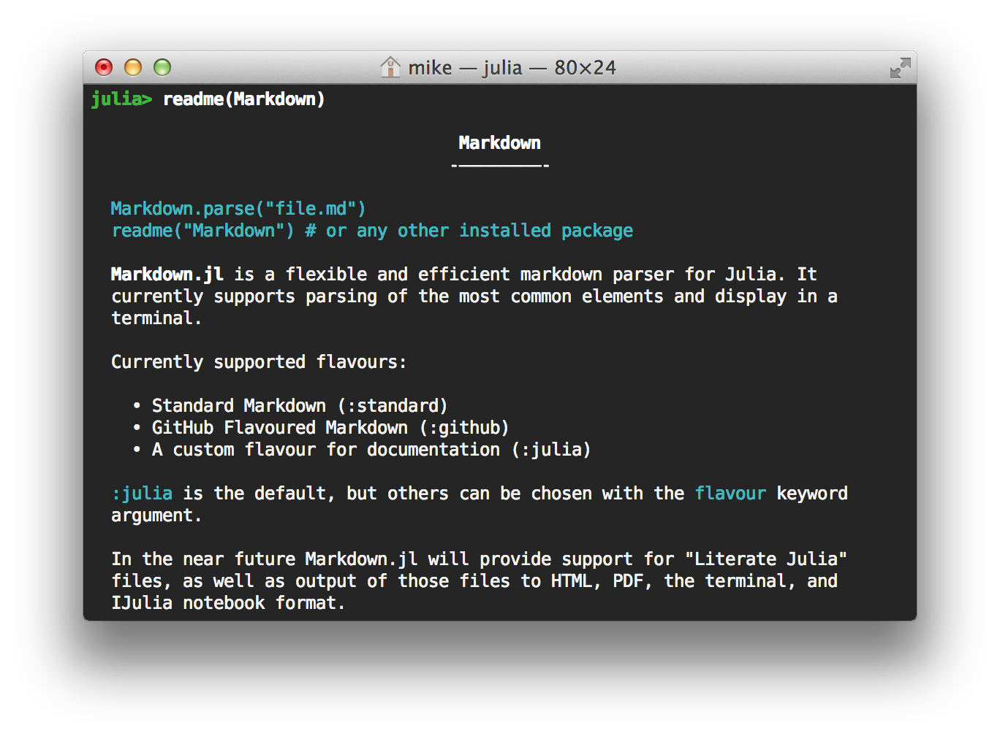

# Markdown

```julia
Markdown.parse("file.md")
readme("Markdown") # or any other installed package
```

**Markdown.jl** is a flexible and efficient markdown parser for Julia.
It currently supports parsing of the most common elements and display
in a terminal.

Currently supported flavours:

  * Standard Markdown (:standard)
  * GitHub Flavoured Markdown (:github)
  * A custom flavour for documentation (:julia)

`:julia` is the default, but others can be chosen with the `flavour`
keyword argument.

In the near future Markdown.jl will provide support for "Literate Julia"
files, as well as output of those files to HTML, PDF, the terminal, and
IJulia notebook format.



### Implementation Overview

Each Markdown flavour is specified declaratively by simply listing the features you want to include; for example, Julia markdown is roughly specified as:

```julia
# Block Elements
[hash_header, list, indented_code, fenced_code, blockquote, underline_header, paragraph]
# Inline Elements
[en_dash, inline_code, asterisk_bold, asterisk_italic, image, link]
```

These are simply functions which share a common interface, called *parsers* – block parsers and inline parsers repectively. Markdown.jl parses markdown files by calling each parser in sequence until one indicates that it has parsed something successfully, at which point it returns to the top of the stack and starts again. `paragraph` acts as a catch-all parser, so it will usually be at the end of the stack.

More precisely, the Julia doc flavour is specified as:

```julia
julia = Config(
  # Block elements
  ["```", '#', underline_header_trigger],
  [hash_header, list, indented_code, fenced_code, blockquote, underline_header, paragraph],
  # Inline elements
  "-`*![", [en_dash, inline_code, asterisk_bold, asterisk_italic, image, link])
```

This is called a config object. Those characters and strings listed before the parser are *triggers*.

Block triggers tell the current block parser to stop immediately; for example, usually `paragraph` will only stop when it meets a blank line, but the ````"```"```` trigger stops it so that `fenced_code` can take over.

Inline triggers tell the current block parser to test whether any of the inner parsers apply. For example, `paragraph` will consume input until it meets one of `[`, `!`, etc., at which point it apply each of the inline parsers and consume the result.

#### Block Parsers

A block parser has the signature

```julia
f(IO, Content, Config)::Bool
```

The `IO` object is the stream to parse, which should either be moved past the parsed object or left alone. The `Content` parameter is the current Markdown tree; this should be modified as appropriate. The `Config` is the current flavour, represented as above. The return value basically indicates whether or not the parser found anything; more precisely, it indicates to Markdown.jl whether to continue on to the next parser on the stack (`false`) or start again from the top (`true`).

#### Inline Parsers

Inline parsers are a little simpler, having the type

```
f(IO)::Content
```

They should simply either parse successfully and return some content object or return nothing.

This design is very flexible; it is very easy to add new elements (just write a small, testable function and add it to the list), and the composability makes it trivial to support multiple variations on the Markdown spec using the same well-tested components. This can even be done from outside of Markdown.jl, i.e. without touching or modifying its internals.
